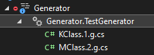
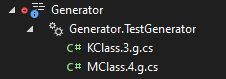
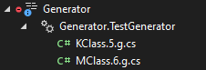
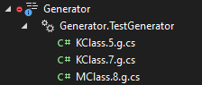

# GeneratorIssues

## Duplicated SyntaxNodes

This project contains very simple incremental source code generator `TestGenerator`, which takes `SyntaxNode`s having `[Generate]` attribute and generates a dummy source code for it. The generated code has a `hintName` format like this: `{Identifier}.{Index}.g` where `Identifier` is the SyntaxNode Identifier and `Index` is a unique incremental number to prevent the unique hintname exception.
Thereshould be no caching involved here, since the generator is not providing any custom equality check.

If everything is working as expected, the result should be 1:1 to the SyntaxNodes with Generate attributes. But it's easy to ends with duplicated generated files for the same SyntaxNode.

### Steps to reproduce:

1. Open and build the solution
2. Re-Open the visual studio to load the generator
    * Don't open any file from "Generator.Test" project yet
3. Initial generated files will be like this (the index number can be different later):
    * 
4. Open file `Generator.Test/NS1/KClass.cs`
    * This will generate new set of files
    * 
5. Uncomment the commented part in the file
    * This will generate new set of files
    * 
6. Open file `Generator.Test/NS2/MClass.cs`
    * This will lead to a duplicate file beeing generated. If not, try also uncommenting the commented part in this file.
    * 
